# EKS Production Cluster Architecture

## 🚀 Overview
Production MSA (Microservice Architecture) environment running on Amazon EKS in ap-northeast-2 region.

### 📊 Cluster Statistics
- **Worker Nodes**: 6 (4 ARM64 + 2 Karpenter managed)
- **Microservices**: 2 (Product Service, Order Service)
- **Namespaces**: 10
- **Load Balancers**: 4 (1 ALB, 3 NLB)

## 🏗️ Architecture Diagram


## 📋 Request Flow Sequence


## 🔧 Core Components

### Infrastructure
| Component | Details |
|-----------|---------|
| **Cluster Name** | prod |
| **Kubernetes Version** | v1.33 |
| **Region** | ap-northeast-2 |
| **VPC** | oliveyoung-prod (10.1.0.0/16) |
| **Availability Zones** | ap-northeast-2a, ap-northeast-2c |

### Networking
| Component | Details |
|-----------|---------|
| **Ingress Controller** | AWS Load Balancer Controller |
| **Load Balancer Type** | Application Load Balancer (ALB) |
| **Service Type** | ClusterIP (internal) |
| **Pod Networking** | AWS VPC CNI |

### Nodes
| Node | Type | Subnet | IP Address |
|------|------|--------|------------|
| ip-10-1-11-154 | Amazon Linux ARM64 | Private 2a | 10.1.11.154 |
| ip-10-1-11-184 | Amazon Linux ARM64 | Private 2a | 10.1.11.184 |
| ip-10-1-12-64 | Amazon Linux ARM64 | Private 2c | 10.1.12.64 |
| ip-10-1-12-169 | Amazon Linux ARM64 | Private 2c | 10.1.12.169 |
| i-0ca8f63396c2f5a20 | Bottlerocket (Karpenter) | Private 2c | 10.1.12.67 |
| i-0e8fcb63c2579bbad | Bottlerocket (Karpenter) | Private 2c | 10.1.12.192 |

## 🎯 Microservices

### Product Service
- **Deployment**: 2 replicas
- **Image**: 928475935003.dkr.ecr.ap-northeast-2.amazonaws.com/product-service:v5
- **Port**: 8081 (container) → 80 (service)
- **Resources**: 
  - Requests: 100m CPU, 128Mi Memory
  - Limits: 200m CPU, 256Mi Memory
- **Service Account**: product-service-sa

### Order Service
- **Deployment**: 2 replicas
- **Image**: 928475935003.dkr.ecr.ap-northeast-2.amazonaws.com/order-service:latest
- **Port**: 8080 (container) → 80 (service)
- **Resources**: 
  - Requests: 100m CPU, 128Mi Memory
  - Limits: 200m CPU, 256Mi Memory
- **Service Account**: order-service-sa

### Kafka
- **Type**: StatefulSet
- **Replicas**: 1
- **Port**: 9092
- **Service Type**: Headless

## 📊 Monitoring Stack

```mermaid
graph LR
    subgraph Monitoring
        Prometheus[📊 Prometheus<br/>Metrics Collection]
        Grafana[📈 Grafana<br/>Visualization]
        Loki[📝 Loki<br/>Log Aggregation]
        Tempo[🔍 Tempo<br/>Distributed Tracing]
        Promtail[🎯 Promtail<br/>Log Shipper]
        Headlamp[👁️ Headlamp<br/>K8s Dashboard]
    end
    
    Prometheus --> Grafana
    Promtail --> Loki
    Loki --> Grafana
    Tempo --> Grafana
```



## 🚀 System Components

| Component | Purpose | Namespace |
|-----------|---------|-----------|
| **AWS Load Balancer Controller** | Manages ALB/NLB | kube-system |
| **Karpenter** | Node autoscaling | karpenter |
| **ArgoCD** | GitOps deployment | argocd |
| **CoreDNS** | Service discovery | kube-system |
| **EBS CSI Driver** | Storage management | kube-system |
| **Metrics Server** | Resource metrics | kube-system |

## 📝 Ingress Rules

```yaml
apiVersion: networking.k8s.io/v1
kind: Ingress
metadata:
  name: msa-ingress
  namespace: production
spec:
  ingressClassName: alb
  rules:
  - http:
      paths:
      - path: /api/v1/products
        pathType: Prefix
        backend:
          service:
            name: product-service
            port:
              number: 80
      - path: /api/v1/orders
        pathType: Prefix
        backend:
          service:
            name: order-service
            port:
              number: 80
```

## 🔒 Security Configuration

### Network Security
- ✅ Worker nodes in private subnets
- ✅ NAT Gateway for outbound traffic
- ✅ Security groups for network isolation
- ✅ Network policies for pod-to-pod communication

### IAM & RBAC
- ✅ IRSA (IAM Roles for Service Accounts)
- ✅ Separate service accounts per microservice
- ✅ Least privilege IAM policies
- ✅ RBAC for namespace isolation

### Data Protection
- ✅ EBS encryption at rest
- ✅ TLS for service-to-service communication
- ✅ Secrets management via K8s Secrets

## 📦 Storage

| Storage Class | Provisioner | Type | Binding Mode |
|--------------|-------------|------|--------------|
| gp2 | kubernetes.io/aws-ebs | gp2 | WaitForFirstConsumer |
| gp3 | ebs.csi.aws.com | gp3 | WaitForFirstConsumer |

## 🔄 CI/CD Pipeline


## 📌 Access Points

### External Access
- **ALB Endpoint**: http://k8s-producti-msaingre-a832bcc2c1-1931180001.ap-northeast-2.elb.amazonaws.com
- **Grafana**: http://aa0f272db301b40e19218d5f38ace125-16d29c4eba987a3e.elb.ap-northeast-2.amazonaws.com
- **Headlamp**: http://ad610fdaa91464022ae22e719a53a468-0ff550a48fbe1c01.elb.ap-northeast-2.amazonaws.com

### API Endpoints
- **Product Service**: `/api/v1/products`
- **Order Service**: `/api/v1/orders`
- **Health Check**: `/api/v1/health`

## 🛠️ Deployment Commands

```bash
# Deploy with kubectl
kubectl apply -f eks-cluster-config.yaml

# Check deployment status
kubectl get all -n production

# View logs
kubectl logs -f deployment/product-service -n production

# Scale deployment
kubectl scale deployment product-service --replicas=3 -n production

# Port forward for debugging
kubectl port-forward service/product-service 8080:80 -n production
```

## 📈 Performance Metrics

- **Target CPU Utilization**: 70%
- **Request Timeout**: 30s
- **Health Check Interval**: 15s
- **Pod Disruption Budget**: 1 (minimum available)

## 🔍 Troubleshooting

### Common Issues

1. **Pod not starting**
   ```bash
   kubectl describe pod <pod-name> -n production
   kubectl logs <pod-name> -n production
   ```

2. **Service not reachable**
   ```bash
   kubectl get endpoints -n production
   kubectl get ingress -n production
   ```

3. **Node issues**
   ```bash
   kubectl get nodes
   kubectl describe node <node-name>
   ```

## 📚 Additional Resources

- [AWS EKS Documentation](https://docs.aws.amazon.com/eks/)
- [Kubernetes Documentation](https://kubernetes.io/docs/)
- [AWS Load Balancer Controller](https://kubernetes-sigs.github.io/aws-load-balancer-controller/)
- [Karpenter Documentation](https://karpenter.sh/)

---
*Generated: 2025-08-19 | Cluster: prod | Region: ap-northeast-2*
